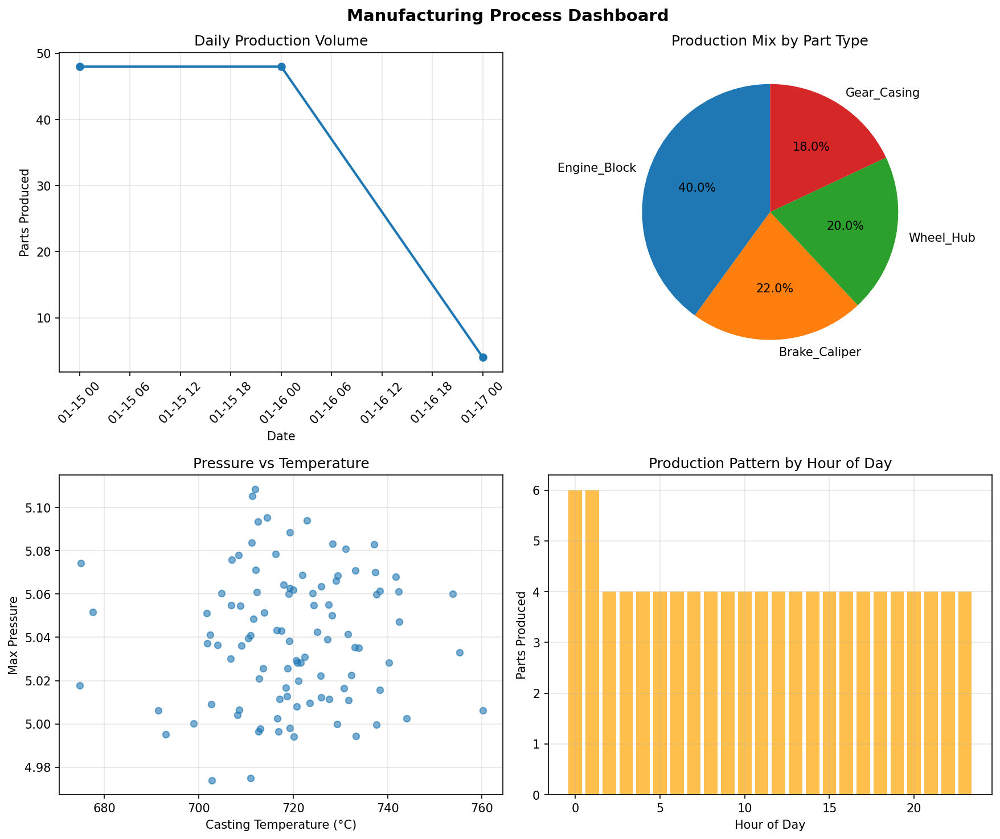
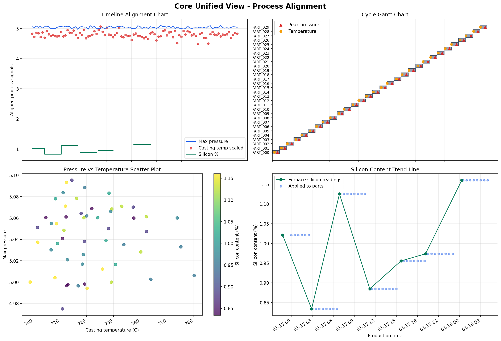
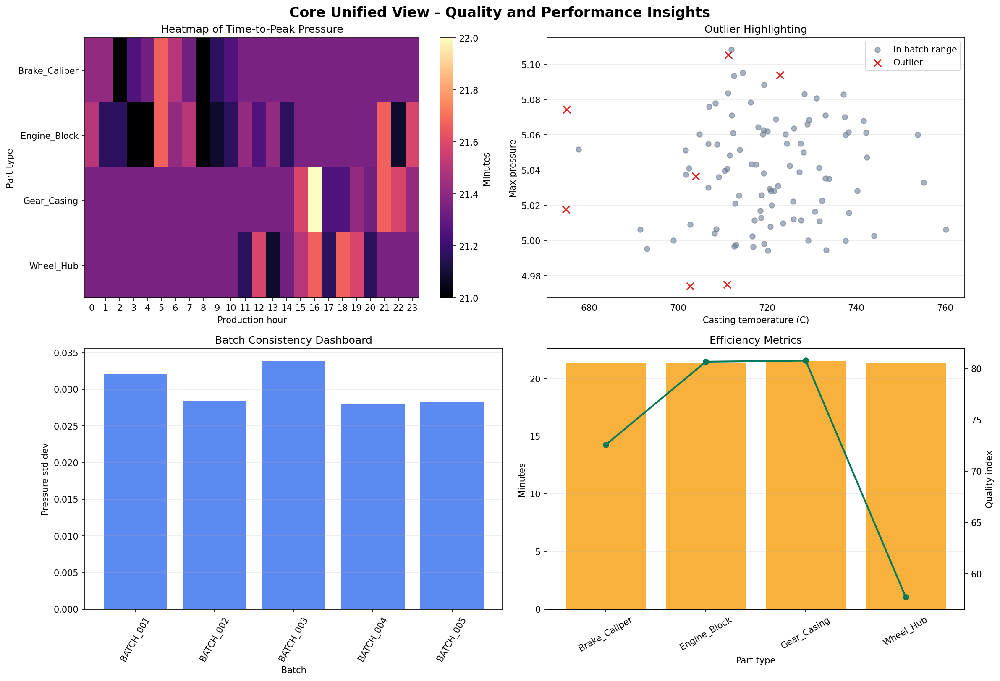

# Foundry Unified View

A production analytics dashboard for aligning foundry process data into one clean, part-level source of truth.

This project takes four manufacturing data streams, production logs, pressure cycles, casting temperatures, and furnace silicon readings, and merges them into a unified dataframe where every row represents one produced part. It then exposes that dataset through static analysis reports and a live Dash dashboard ready for deployment on Render.



## What This Solves

Foundry process data is rarely recorded at the same time or frequency.

- Production logs identify which part was made and when the cycle started.
- Pressure sensors produce dense time-series readings throughout each casting cycle.
- Casting temperature is logged near the beginning of the cycle.
- Furnace silicon chemistry is measured less frequently and applies forward for several hours.

The goal is to make these separate signals feel like one coherent production record. The Core Unified View gives engineers, analysts, and operators a single place to inspect process behavior, compare batches, and identify parts that may need review.

## Core Unified View

The main dataset is generated by [unified.py](unified.py).

Outputs:

- `unified_manufacturing_view.csv`
- `unified_manufacturing_view.parquet`
- `unified_quality_alerts.csv`

Each row represents one `unique_part_identifier`.

Key columns:

| Column | Meaning |
| --- | --- |
| `unique_part_identifier` | Unique part-level production ID |
| `part_type` | Forward-filled part type from production logging |
| `production_batch_id` | Derived batch ID based on part type changes |
| `cycle_start_timestamp` | Start of the part production cycle |
| `pressure_cycle_end_timestamp` | Last pressure reading in the cycle |
| `max_pressure` | Maximum pressure reached during casting |
| `peak_pressure_timestamp` | Timestamp where max pressure occurred |
| `time_to_peak_min` | Minutes from cycle start to peak pressure |
| `casting_temperature_C` | Aligned casting temperature |
| `temperature_timestamp` | Source timestamp for the matched temperature reading |
| `silicon_content_percent` | Applicable furnace silicon content |
| `silicon_timestamp` | Source timestamp for the matched silicon reading |
| `pressure_outlier` | Part deviates from batch pressure norms |
| `temperature_outlier` | Part deviates from batch temperature norms |
| `silicon_drift_alert` | Silicon changes sharply between aligned parts |
| `missing_alignment_alert` | Pressure, temperature, or silicon alignment is missing |
| `temperature_stability_index` | Batch-level temperature stability KPI |
| `unified_part_quality_index` | Composite quality score from alerts and process stability |

## Time Alignment Logic

The key technical challenge is temporal alignment.

### Pressure

Pressure data is recorded every 10 seconds during a cycle. The pipeline groups pressure readings by `unique_part_identifier`, then extracts:

- maximum pressure
- timestamp of peak pressure
- minutes from cycle start to peak
- average pressure
- pressure variance
- cycle duration

### Temperature

Casting temperature is recorded near the beginning of the casting cycle, so it is matched to the nearest production cycle start within a 20-minute tolerance:

```python
pd.merge_asof(
    production,
    temperature,
    left_on="cycle_start_timestamp",
    right_on="temperature_timestamp",
    direction="nearest",
    tolerance=pd.Timedelta("20 minutes"),
)
```

### Silicon

Furnace silicon is measured less frequently and applies forward from the time of measurement. To assign the most recent valid silicon reading to each part, the pipeline uses backward as-of matching with a 4-hour tolerance:

```python
pd.merge_asof(
    production,
    silicon,
    left_on="cycle_start_timestamp",
    right_on="silicon_timestamp",
    direction="backward",
    tolerance=pd.Timedelta("4 hours"),
)
```

This is an important assumption: a silicon reading describes the furnace chemistry from that timestamp forward, not the next future reading.

## Live Dashboard

The deployable dashboard lives in [dashboard_app.py](dashboard_app.py).



Dashboard features:

- Unified Part View: interactive table with part type, batch, date, sorting, and filtering.
- Pressure Cycle Explorer: line chart with peak pressure markers.
- Temperature Stability Monitor: batch temperature trend with stability index overlay.
- Silicon Content Overlay: step-line view of silicon values applied to production cycles.
- Anomaly Alerts: highlighted rows and alert cards for pressure, temperature, silicon drift, and missing joins.
- Quality Map: pressure vs temperature scatter with alert and part-type context.

The app reads `unified_manufacturing_view.csv`. If the file is missing, it can regenerate the sample pipeline automatically.

## Static Analysis Outputs

The project also produces static dashboards for reporting and review.

| File | Purpose |
| --- | --- |
| `final_dashboard.png` | Executive dashboard summary |
| `unified_view_analysis.png` | Baseline process analysis |
| `process_alignment_dashboard.png` | Timeline alignment, Gantt view, scatter, and silicon trend |
| `quality_insights_dashboard.png` | Time-to-peak heatmap, outliers, batch consistency, and efficiency KPIs |
| `executive_summary.txt` | Plain-text management summary |
| `detailed_statistics.csv` | Statistical profile of the unified dataset |



## Project Structure

```text
foundry-unified-view/
+-- app/
|   +-- production_logging_data.parquet
|   +-- pressure_data.parquet
|   +-- casting_temperature_data.parquet
|   +-- furnace_silicon_data.parquet
+-- dashboard_app.py
+-- unified.py
+-- generate_sample_data.py
+-- create_final_report_simple.py
+-- requirements.txt
+-- render.yaml
+-- unified_manufacturing_view.csv
+-- unified_manufacturing_view.parquet
+-- unified_quality_alerts.csv
```

## Quickstart

Create and activate a virtual environment:

```bash
python -m venv .venv
.venv\Scripts\activate
```

Install dependencies:

```bash
pip install -r requirements.txt
```

Generate or refresh the unified dataset:

```bash
python unified.py
```

Generate the final static report:

```bash
python create_final_report_simple.py
```

Run the live dashboard:

```bash
python dashboard_app.py
```

Open:

```text
http://127.0.0.1:8050
```

To use another port:

```bash
set PORT=8051
python dashboard_app.py
```

## Deploying On Render

This repo includes [render.yaml](render.yaml), so Render can detect the service configuration automatically.

Manual Render settings:

| Setting | Value |
| --- | --- |
| Environment | Python |
| Build command | `pip install -r requirements.txt` |
| Start command | `gunicorn dashboard_app:server` |
| Python version | `3.12.2` |

Deployment steps:

1. Push this repository to GitHub.
2. Create a new Render Web Service.
3. Connect the GitHub repository.
4. Use the included `render.yaml`, or enter the manual settings above.
5. Deploy.

## Quality And Alert Rules

The anomaly layer is intentionally transparent and easy to inspect.

| Alert | Rule |
| --- | --- |
| `pressure_outlier` | Absolute pressure z-score within batch is greater than 2 |
| `temperature_outlier` | Absolute temperature z-score within batch is greater than 2 |
| `silicon_drift_alert` | Silicon content changes by more than 0.15 between aligned parts |
| `missing_alignment_alert` | Any required aligned process value is missing |

The `unified_part_quality_index` starts from 100 and is reduced by alert count, pressure variability, and temperature instability. It is not a final defect prediction model; it is a practical inspection score for comparing parts and batches.

## Current Data Notes

The included sample dataset contains 100 produced parts across four part types:

- `Brake_Caliper`
- `Engine_Block`
- `Gear_Casing`
- `Wheel_Hub`

In the generated sample data, some later parts do not receive a valid silicon match because the furnace chemistry readings do not cover the full production window. Those records are retained and flagged with `missing_alignment_alert` rather than silently filled.

## Technology Stack

- Python
- pandas
- NumPy
- Matplotlib
- Plotly
- Dash
- PyArrow
- Gunicorn
- Render

## Useful Commands

Run the full data and reporting pipeline:

```bash
python unified.py
python create_final_report_simple.py
```

Run the live dashboard locally:

```bash
python dashboard_app.py
```

Run on a custom port:

```bash
set PORT=8051
python dashboard_app.py
```

## Future Enhancements

The current Core Unified View already contains the timestamps and KPIs needed for deeper interactive layers:

- Interactive replay mode for individual part production cycles.
- Digital twin overlays comparing actual process data against ideal part-type profiles.
- Predictive defect risk using historical quality labels.
- Real-time ingestion from production systems.
- Operator-facing alert thresholds by part type and batch.

## Summary

Foundry Unified View turns asynchronous manufacturing signals into a part-level operating picture. It gives every part a process history, every batch a stability profile, and every anomaly a visible place in the dashboard.
